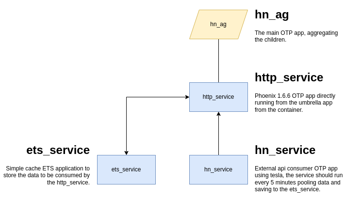

# Hacker News Aggregator

This is yet another [Hacker News](https://news.ycombinator.com/) aggregator. But this time built in Elixir, saving data into ETS and pooling data in batches from the [Hacker News API](https://github.com/HackerNews/API).

You can reference the following diagram in order to understand how the application is built along with a brief explanation of each OTP app in it.



## Installation

Clone the repository via `git clone https://github.com/er-jpg/hn-ag`.

## Usage

Set up the `SECRET_KEY_BASE` env with

```bash
export SECRET_KEY_BASE=$(elixir --eval 'IO.puts(:crypto.strong_rand_bytes(64) |> Base.encode64(padding: false))')
```

Export the `DATABASE_URL` with

```bash
export DATABASE_URL=ecto://postgres:postgres@db:5432/data_service
```

### Docker compose

When running the application from a container the following steps
 - create a new `.env` using the [.env.example](./.env.example)
 - build and run the image using docker-compose `docker-compose up --build`

### Manually

Running the application via terminal use the following steps

 - Enter the app folder Ex.: `cd lib/apps/http_service`
 - Run the application with `iex` Ex.: `iex -S mix`


### Endpoints

Currently the `http_server` has the following endpoints:
  - `[GET]/health` returns status 200
  - `[GET]/api/stories&page=1` which returns a list of stories currently on memory
  - `[SUB]/websocket` websocket for getting notifications of new stories

The `/websocket` upon entry requires the user to join a topic, you can use the following example: 

```json
{
  "topic": "story",
  "event": "phx_join",
  "payload": {},
  "ref": "story"
}
```

One recomendation for testing websocket using javascript is the following:

```javascript
let webSocket = new WebSocket('ws://localhost:4000/websocket')
webSocket.onmessage = function(e) { console.log(e) }
webSocket.send(`{"topic": "story","event": "phx_join","payload": {},"ref": "story"}`)
```

And to clear the data inside the docker-compose
  1. `docker-compose exec elixir bin/hn_ag remote`
  2. `DataService.clear_data()`
  3. `HnService.Worker.do_task_now!()`

## Testing and code quality

### Testing
To run tests just run in the root folder of the repo `mix test --no-start`. Or you can run the command inside each application in the `apps` folder individually.

### Test coverage
When checking test coverage you can just run `MIX_ENV=test mix coveralls -u`. Plase note to use the `-u` flag when running from the root directory.

### Lint
The lint of code is done via [credo](https://github.com/rrrene/credo) and in the root of repo just run `mix credo`.


## TODO

  * ~~fix tests and implement mox to external api calls, currently when the worker starts the mox doesn't run and can't find the mock~~
  * implement `select_count/3` for pagination inside the ETS, but it still requires learning how to match
  * figure out how to test the list stories endpoint and the websocket
  * add first story when subscribe to websocket
  * ~~fix worker and data_service tests because the PubSub doesn't start with the ETS OTP app~~
  * fix issue with docker database not creating default database on first startup


## Contributing
Pull requests are welcome. For major changes, please open an issue first to discuss what you would like to change.

Please make sure to update tests as appropriate.

---

[Back to the top](#hacker-news-aggregator)